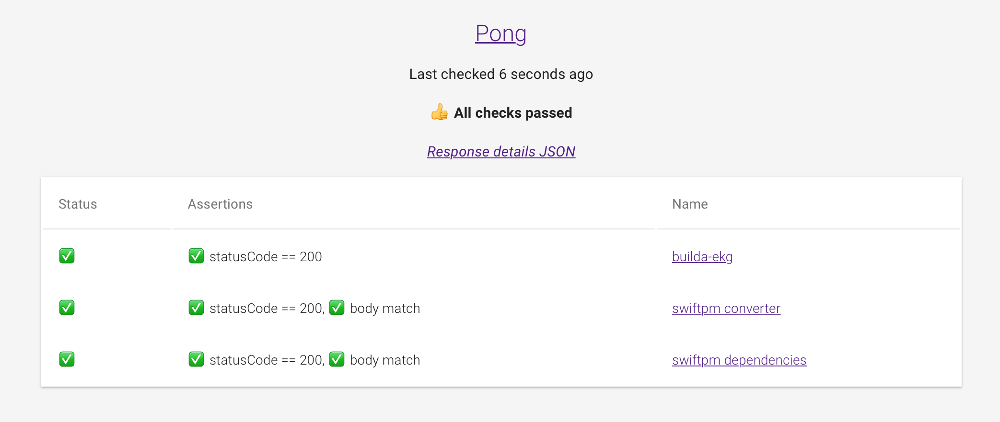

# :bell: Pong

Self-deployed server uptime monitoring.

Do you have servers that you need to ensure are up at all times? Are you also annoyed that dedicated uptime monitoring services cost *more* than the servers you're running on? Then just deploy your own monitoring server. That's where Pong comes in.

Pong lets you
- define URLs to periodically call with a specified HTTP method and an optional body
- define assertions that need to be verified after a response returns
- run all these periodically (every 60 seconds by default)
- if any assertion fails, you get an email telling you which assertion failed
- you get an email again once the failure has been fixed
- configure everything from json files: [pings](Config/pings.json) and [server](Config/server.json).

Very simple, but covers most of the basic needs of ensuring your service is up and functioning correctly. But as always, PR's welcome!

# Pong Assertions

Each response from a monitored server is evaluated against a set of `assertions`. So far these assertions are available:
- `statusCode` - ensures a response ended with a specific status code
- `body` - ensures a response's body matches provided data

To build more assertions, just create a new type conforming to `PongAssertion`

# Deployment steps

- fork this repo
- create a [SendGrid](sendgrid.com) account and create new credentials, which you'll supply in `$PONG_EMAIL_USERNAME` and `$PONG_EMAIL_PASSWORD` later
- edit the file [`Config/pings.json`](Config/pings.json) and [`Config/server.json`](Config/server.json) to your liking
- create a new droplet on Digital Ocean with Docker running on Ubuntu
- clone your fork of this project there
- build the image with `docker build .`
- start a container with 

```

docker run -it -d --restart=on-failure -v $PWD:/package -p 80:8080 -e "PONG_EMAIL_PASSWORD=$PONG_EMAIL_PASSWORD" -e "PONG_EMAIL_TARGET=$PONG_EMAIL_TARGET" -e "PONG_EMAIL_USERNAME=$PONG_EMAIL_USERNAME" IMAGE_ID

``` 

where you supply your own environment variables `PONG_EMAIL_PASSWORD`, `PONG_EMAIL_USERNAME` and `PONG_EMAIL_TARGET` (which is for the email address to which to send emails when you services go down). `IMAGE_ID` is the built image from `docker build .`

# Web frontend

If you navigate to your server in the browser, you'll get a quick status page



:gift_heart: Contributing
------------
Please create an issue with a description of your problem or open a pull request with a fix.

:v: License
-------
MIT

:alien: Author
------
Honza Dvorsky - https://honzadvorsky.com, [@czechboy0](https://twitter.com/czechboy0)

